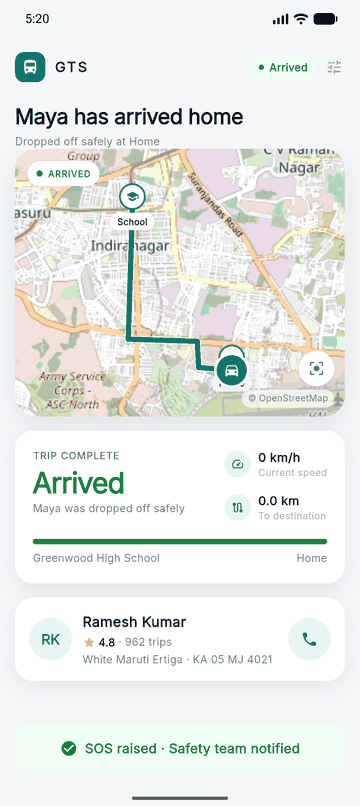
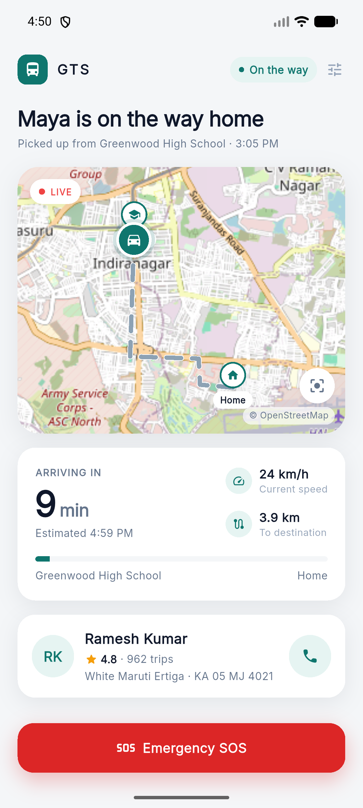
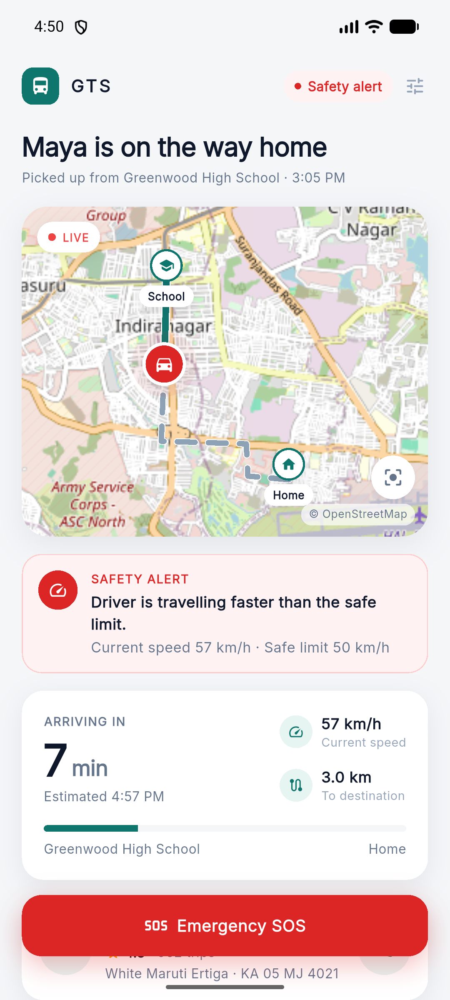
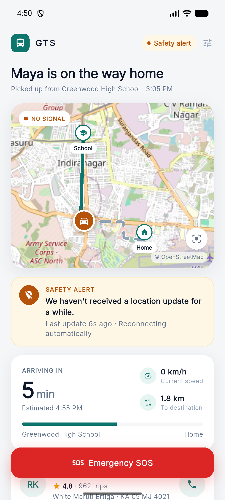
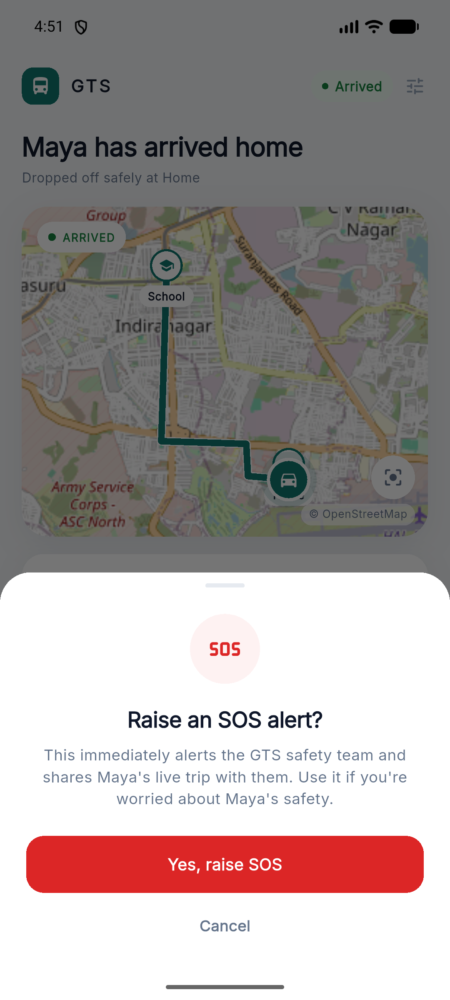
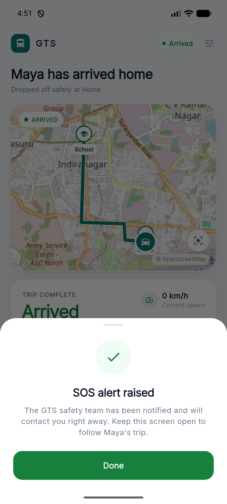

# GTS — Parent Trip Tracking Prototype


A polished Flutter prototype of the **GTS (Go To Shore)** parent experience: a
parent opens the app while their child is travelling home from school, sees the
live journey at a glance, receives plain-language safety alerts, and can raise
an SOS with an explicit confirmation step.

<p align="center">
  
</p>
<p align="center"><sub>One continuous run: live tracking → overspeed alert → recovery → lost location → arrival → SOS confirm → success.</sub></p>

## Screens

| Live trip | Overspeed | Location lost | SOS confirm | SOS raised |
| :---: | :---: | :---: | :---: | :---: |
|  |  |  |  |  |
| ETA hero, speed, distance, progress | Red alert, exact speed vs. limit | Amber alert, "NO SIGNAL" chip | Deliberate confirmation step | Persistent success state |

## Features

- **Active trip screen** — child, driver (name, rating, trip count), vehicle +
  plate, school → home, live status pill that a safety alert can take over
- **Real map** — OpenStreetMap via `flutter_map`: travelled route (solid) vs.
  remaining (dashed), school/home markers, an animated driver marker that
  glides between updates with an alert-colored pulsing ring, recenter control
- **Live metrics** — ETA (hero number + wall-clock estimate), current speed,
  distance to destination, school→home progress bar, all recomputed every tick
- **Safety alerts** (plain parent language, no technical jargon)
  - *Overspeeding* — red: "Driver is travelling faster than the safe limit." with current speed vs. limit
  - *Location stopped/unavailable* — amber: "We haven't received a location update for a while." with time since last update
  - Both show a brief green **resolved** state when the condition clears
- **SOS flow** — tap → confirmation sheet → raising → success, then a
  persistent "SOS raised · Safety team notified" bar for the rest of the trip
- **Loading / error / retry** states for the initial trip fetch
- **Demo controls** (tune icon, top-right) — pause/resume, trigger overspeed,
  trigger lost location, jump near arrival, restart

## Run

```bash
flutter pub get
flutter run
```

Internet access is needed for OpenStreetMap tiles; everything else is local.
Built and verified with Flutter 3.35.5 / Dart 3.9.2 on Android.

```bash
flutter test                     # provider + route geometry unit tests
flutter build apk --release      # build/app/outputs/flutter-apk/app-release.apk
```

## Architecture

```
lib/
  app/                    MaterialApp + theme tokens (AppColors, AppTextStyles)
  core/
    constants/            safety thresholds & simulation tuning in one place
    models/               Trip, DriverLocation, SafetyAlert
  features/active_trip/
    data/                 mock route (LatLng polyline) + deterministic timeline
                          + RouteGeometry (progress → position, path splitting)
    provider/             ActiveTripProvider — all state & simulation logic
    presentation/         screen + presentational widgets (map, metrics,
                          header, driver card, alert card, SOS button/sheet)
test/                     provider & geometry unit tests (no timers needed)
```

**The key design decision:** every displayed value (position, speed, distance,
ETA, status, alerts) is *derived purely from an index into a deterministic mock
timeline*, advanced by a periodic `Timer`. The demo controls and the unit tests
drive the exact same seek path as the timer — so the demo plays out identically
on every run and the logic is testable without any timer machinery.

The location-lost alert is not scripted directly: the provider detects that the
position hasn't changed for N consecutive ticks — the same rule a real backend
would apply.

All driver movement is simulated with deterministic local mock data — no
backend, authentication, or real GPS is required. The SOS flow is fully
simulated; no real emergency service is contacted.
